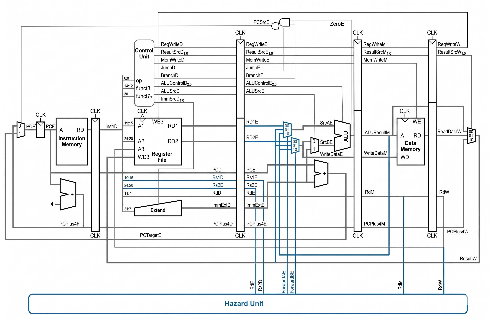

# RISCV-Pipelined-32bit-Simulation

# 5-Stage Pipelined RISC-V 32-bit Processor with Hazard Unit on FPGA

## 📌 Project Overview
Dự án thiết kế và tổng hợp (Synthesis) vi xử lý RISC-V 32-bit dựa trên tập lệnh RV32I, ứng dụng kiến trúc đường ống 5 bước (5-Stage Pipeline). Hệ thống được tích hợp khối phân tích và giải quyết xung đột (Hazard Unit) thời gian thực, đồng thời được tối ưu hóa để triển khai và gỡ lỗi trực tiếp trên bo mạch FPGA thông qua các ngoại vi vật lý (LED, 7-Segment Display, Nút nhấn).

## 🛠️ Tools & Technologies
* **Hardware Description Language:** Verilog HDL
* **Architecture:** RISC-V (RV32I Base Integer Instruction Set)
* **Design Type:** 5-Stage Pipelined (IF, ID, EX, MEM, WB)
* **Synthesis & Deployment:** Intel Quartus Prime, FPGA Cyclone Series
* **Verification:** Testbench Simulation & On-board Hardware Debugging

## 🚀 Key Technical Achievements (Thành tựu kỹ thuật cốt lõi)

### 1. 5-Stage Pipeline Architecture
Thiết kế và đồng bộ hóa thành công chu trình lệnh qua 5 giai đoạn: Fetch (IF) $\rightarrow$ Decode (ID) $\rightarrow$ Execute (EX) $\rightarrow$ Memory (MEM) $\rightarrow$ Writeback (WB) sử dụng các thanh ghi chốt tầng (Pipeline Registers: `reg_if_id`, `reg_id_ex`, `reg_ex_mem`, `reg_mem_wb`).

### 2. Dynamic Hazard Resolution (Xử lý xung đột động)
Triển khai thành công module `Hazard_Unit` để giải quyết các rủi ro của kiến trúc Pipeline:
* **Data Hazards:** Tích hợp bộ chuyển tiếp dữ liệu (Forwarding) qua các tín hiệu `ForwardAE`, `ForwardBE` để tái sử dụng dữ liệu từ bước MEM hoặc WB ngược về bước EX mà không cần dừng hệ thống.
* **Load-Use & Control Hazards:** Xử lý các lệnh rẽ nhánh (Branching) và trễ tải dữ liệu bằng kỹ thuật làm trễ (Stall) và xóa luồng lệnh (Flush).

### 3. FPGA Hardware Debugging Unit
Tự phát triển khối giao tiếp vật lý (Wrapper Module `RISC_FPGA_Top`) cho phép:
* Chuyển đổi linh hoạt giữa xung nhịp tự động (`clk_auto`) và xung nhịp thủ công bằng nút nhấn cơ học (`clk_manual`) có tích hợp logic Debounce để gỡ lỗi từng chu kỳ lệnh (Step-by-step Execution).
* Sử dụng hệ thống Multiplexer 8 kênh (`choose_output Debug_Mux`) để theo dõi trực tiếp các thanh ghi quan trọng (PCF, InstrD, ALU Result, Data Memory) và xuất tín hiệu ra 8 LED 7 đoạn (HEX0 - HEX7).
* Giám sát trạng thái Pipeline (Stall, Flush, Forwarding) theo thời gian thực thông qua hệ thống LED đơn (LEDR).

## 📁 Repository Structure

*   `./RVPL/`: Chứa toàn bộ mã nguồn RTL (Verilog HDL) cấu thành vi xử lý (Datapath, Control Unit, Hazard Unit, và FPGA Wrapper `RISC_FPGA_Top.v`).
*   `./RVPL_TestBench/`: Chứa các kịch bản kiểm thử (Testbench) phục vụ quy trình mô phỏng chức năng hệ thống.
*   `./pictures/`: Lưu trữ giản đồ sóng (Waveform) và hình ảnh kết quả debug trạng thái Pipeline trực quan.
*   `./RISCV_Pipeline_Report.pdf`: Báo cáo kỹ thuật chi tiết phân tích toàn diện kiến trúc hệ thống và kết quả kiểm thử thực tế.
